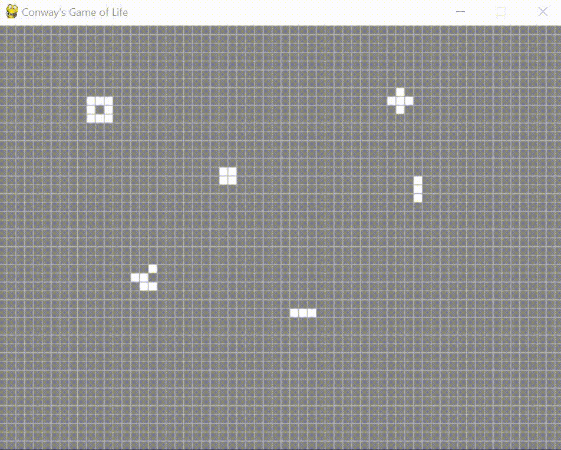
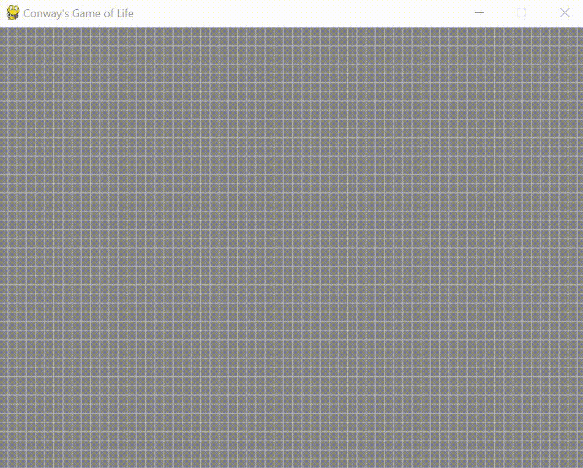

# About 
This is a recreation of Conway's Game of Life. It is a 'zero player game'. Other than some user input, once it gets started there is no more player input, and the following rules govern what happens: 

If a cell is alive(white):
-if it is surrounded by more than 3 alive ones, it dies
-if it is surrounded by less than 2 alive ones, it dies
-otherwise, it stays alive

If a cell is dead(empty):
-if it is surrounded by exactly three alives ones, it is revived
-otherwise, it remains dead

The wikipedia page about it explains it pretty well. 

## The Program

When the window opens, the user has the oppurtunity to input their own pattern into onto the grid. Once they press space, they exit the editing mode and the program takes over. At any point the user can press space again to enter editing mode. Be warned that input can be a bit buggy, but after a few clicks it should respond. This was a short project to become a bit more familiar with python, so when I have time I may go back and patch things up. 

